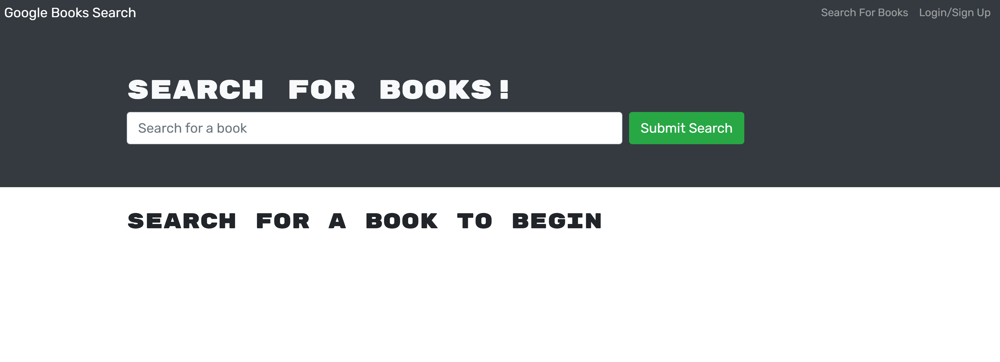

# book-search-engine

## Description
This project refactors a RESTful API to a GraphQL API, and with Apollo Server. This app uses the MERN stack: MongoDB, Expresss.js, React, and Node.js. Users can create accounts, search for books, and save them to a list. User can view their saved books in a seperately rendered page, as well as remove books from their saved list

## Tools 
* Create React App 
* React
* Node.js
* Express.js
* MongoDB and mongoose
* json web tokens
* heroku deployment

## Deployed App
The live site can be visited here ------> https://guarded-savannah-99586.herokuapp.com/

## Screenshot 
